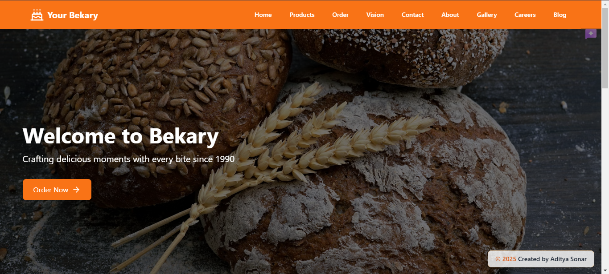

# I am a new developer so please tell me if I have done somting wrong in this project -Adityasonar29

This is my first commit please support

# Bakery Website




A modern, responsive website for Bakery built with React, TypeScript, and Tailwind CSS.

## Features

- 🛒 Product catalog with filtering and search
- 📱 Responsive design
- 🎨 Modern UI with Tailwind CSS
- 🔐 Admin dashboard for product management

## Tech Stack

- React 18
- TypeScript
- Tailwind CSS
- React Router Dom
- Framer Motion
- React Icons

## Getting Started

### Prerequisites

- Node.js (version 16 or higher)
- npm or yarn

### Installation

1. Clone the repository
```bash
git clone https://github.com/Adityasonar29/bakery.git
```

2. Install dependencies
```bash
npm install
```

3. Run the development server
```bash
npm run dev
```

### Project Structure

```markdown
bakery/
├── src/
│   ├── components/     # Reusable components
│   ├── pages/         # Page components
│   ├── context/       # React context files
│   ├── types/         # TypeScript type definitions
│   ├── utils/         # Utility functions
│   └── App.tsx        # Main application component
├── public/            # Static files
└── package.json       # Project dependencies
```

### Available Scripts

- `npm run dev` - Start development server
- `npm run build` - Build for production
- `npm run preview` - Preview production build
- `npm run lint` - Run ESLint
- `npm run type-check` - Run TypeScript type checking

## Additional Information

This README includes:
- Project overview
- Features list
- Technology stack
- Setup instructions
- Project structure
- Available scripts
- Contributing guidelines
- Author credits

Feel free to customize any section to better match your project's specific needs!

## Author

- **Aditya Sonar** ([@Adityasonar29](https://github.com/Adityasonar29))
  - 📧 Email: [adityavispute29@gmail.com]


## Acknowledgments

- Thanks to all contributors who have helped with this project
- Special thanks to the React and Vite communities
- Inspired by modern bakery management systems

